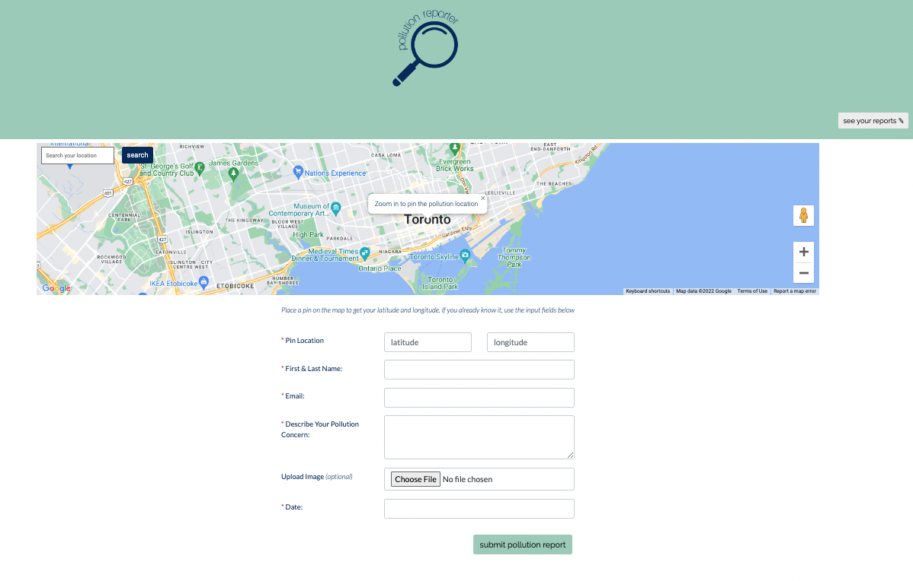
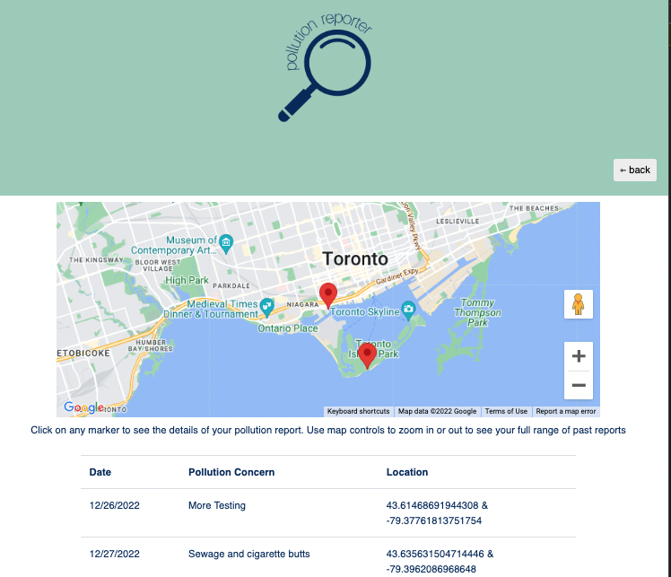

# Pollution Reporter - w/Google Maps

## Table of Contents
- [Description](#Description)
- [Future-Development](#Future-Development)
- [Technologies](#Technologies)
- [Usage](#Usage)

## Description
We've all been taught that pollution is bad - but very few of us have been taught what to do when we see pollution in real time. This application has been built as the frontend of a citizen-scientist (that's you) pollution reporting app. Using the Google Maps API, users can search their current location - and then zoom in and pin point the exact location of pollution they see. Once the location is pinned, users can share further details - including a description of the pollution they see, the date, and optional image, as well as their contact details for any future followup.

Users have the ability to see all of ther past pollution reports (saved in local storage). Past pollution report sites are pinned on the map, as well as listed in an easy-to-read table

This is a mock of a real-life pollution reporting website - and as such details currently sit on users computers. As this application is developed functionality will increase and could be used to submit real-time pollution reports to government agencies and environmental-groups. 

## Future-Development
This application has been initially set up a simple frontend application in order to explore and experiment with the Google Maps API. Future directions for development will include:
    - Build backend database to store pollution reports from multiple users. Build in the function for querying past data for research
    - Expand applications use as a Progressive Web Application, so that users can download the application and use on the go and without internet connection
    - Exploration of further Google Maps features which could be implemented on the site

## Technologies
- HTML
- CSS
- Bootstrap
- JavaScript
- JQuery
- Google Maps SDK, including Google Maps JavaScript API and Geocoding API

## Usage
This application requires a Google Maps API key. To run this application locally, you can make a copy of the files and add your API key to enable map features. 

